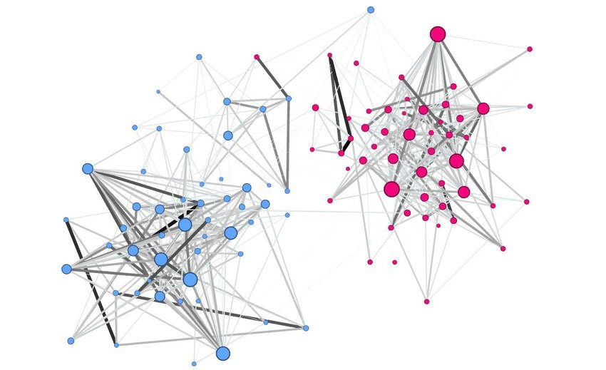

# Network Analysis on Amazon CoPurchasing Data

This project is a part of our 7th semester coursework `19ZO02 - Social & Economic Network Analysis`. Our objective is to analyze the co-purchase data of Amazon to construct a social network among specific products, especially books and identify the critical measures for sales.

## Authors
- [@soumen7saha - 19z245](https://www.github.com/soumen7saha)
- [@VivekanandhanS - 19z261](https://github.com/Vivekanandhan-Sankar)
- 
-
-

