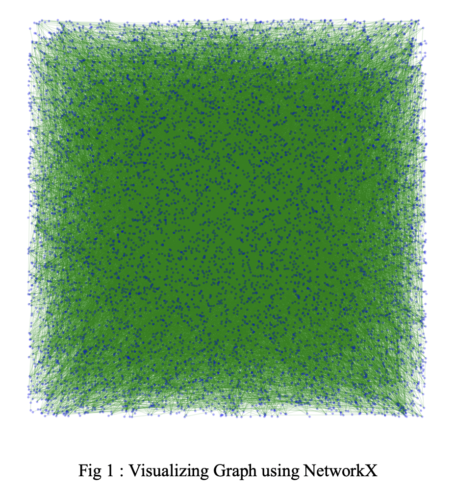
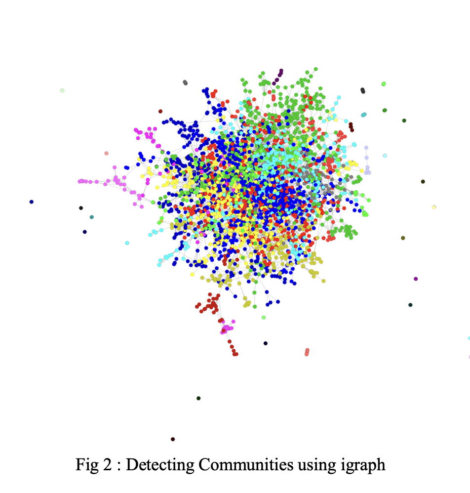

# Network Analysis on Amazon Co-Purchasing Data

This project is a part of our 7th semester coursework `19ZO02 - Social & Economic Network Analysis`. Our objective is to analyze the Amazon co-purchase data among specific products, especially books and identify the critical aspects of network theory like Link Prediction, Community Detection.

## Dataset Used:
- [Stanford Large Network Dataset Collection]

## Major Modules Included:
- [Link Prediction](https://github.com/soumen7saha/Network-Analysis-on-Amazon-CoPurchasing-Data/tree/main/Link%20Prediction)
- [Community Detection](https://github.com/soumen7saha/Network-Analysis-on-Amazon-CoPurchasing-Data/tree/main/Community%20Detection)
- [Book Recommendation](https://github.com/soumen7saha/Network-Analysis-on-Amazon-CoPurchasing-Data/tree/main/Book%20Recommendation)

## Screenshots:

## Contributors:
- [PRANAV VARDHAN G A - 19Z232](https://github.com/pranav112001)
- [RAKESH M - 19Z235](https://github.com/rakeshmmr) 
- [SIVASUBRAMANIAM J - 19z244](https://github.com/Sivasubramaniam28)
- [SOUMEN SAHA - 19Z245](https://www.github.com/soumen7saha)
- [VIVEKANANDHAN S - 19Z261](https://github.com/Vivekanandhan-Sankar)
